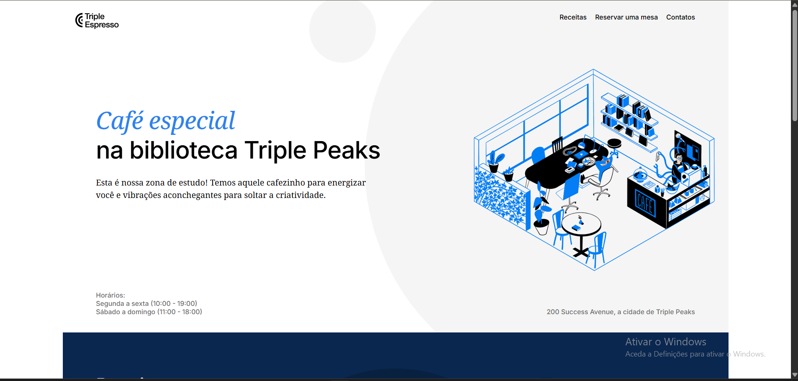
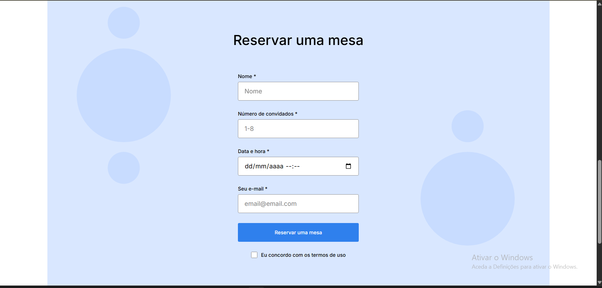

# Triple Espresso

## Descrição

Este projeto consiste na criação de uma página web para uma cafetaria chamada "Triple Espresso", desenvolvida no âmbito do Sprint 4 do curso de Desenvolvimento Web da TripleTen.

A página apresenta informações sobre receitas, eventos e inclui um formulário de reservas para os utilizadores.

## Funcionalidades

- Navegação entre secções da página;
- Apresentação de eventos e receitas;
- Formulário de reserva com validação de dados;
- Layout estruturado com base no design fornecido.

## Tecnologias e Técnicas Utilizadas

- HTML (estrutura semântica);
- CSS (Flexbox, posicionamento);
- Metodologia BEM (organização de classes);
- Normalize.css;
- Google Fonts;
- Git;
- etc.

## Imagens do Projeto

### Página inicial

### Secção de reservas

## Estrutura do Projeto

- /images - imagens do projeto
- /styles - ficheiros CSS
- /vendor - bibliotecas externas
- index.html - página principal

## Observações

Este projeto foi desenvolvido seguindo o roteiro e checklist fornecidos pela TripleTen no âmbito do curso anteriormente referido.
